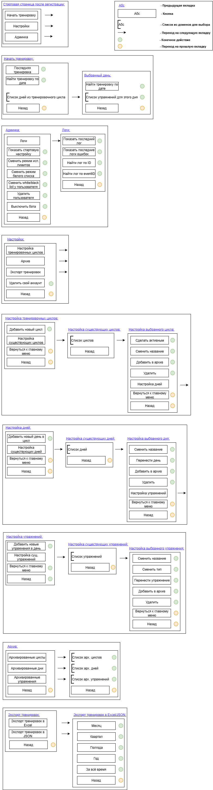

# :robot: WorkoutStorageBot

Простой Telegram-бот для записей, хранения и просмотра результатов тренировок

## :pushpin: Описание

**WorkoutStorageBot** — умеет:

- Хранить результаты тренировок, разбивая их на циклы и дни
- Показывать последние данные тренировок, а так же фильтровать результаты по дням
- Экспортировать данные тренировок в .xlsx и .json файлы
- Динамически настраивать циклы, дни, упражнения

---

## :rocket: Quick Start

Чтобы быстро запустить бота, следуйте этим шагам:

### 1. Клонируйте репозиторий

```
git clone https://github.com/Grawter/WorkoutStorageBot.git
```

### 2. Заполните стартовую настройку

```
cd WorkoutStorageBot/WorkoutStorageBot/Application/StartConfiguration
nano appsettings.json
```

Укажите токен своего телеграм бота в Bot->Token

```
{
  "DB": {
    "EnsureCreated": "true",
    "Server": "",
    "Database": "data/test.db",
    "UserName": "",
    "Password": ""
  },

  "Bot": {
    "Token": "<Your telegram bot token>",
    "WhiteListIsEnable": "False",
    "OwnersChatIDs": [ "0" ],
    "IsNeedCacheContext": "False",
    "IsNeedLimits": "False"
  },

  "Notifications": {
    "NotifyOwnersAboutCriticalErrors": "False",
    "NotifyOwnersAboutRuntimeErrors": "False"
  },

  "LogInfo": {
    "MainRuleLog": {
      "DBLogLevels": [ "Error", "Critical" ],
      "ConsoleLogLevels": [ "All" ]
    }
  }
}
```

### 3. Соберите и запустите бота

```
cd ../..
docker-compose up -d
```

### 4. Создайте свой первый тренировочный цикл


## :world_map: Карта кнопок


## :jigsaw: Полное описание настройки appsettings.json

```
{
  // Настроить считывание настроек под свои нужды можно в ConfigurationData -> GetConfiguration

  /*
  Настройки подключения к БД.
  По-умолчанию, используется SQLite, в случае необходимости можно поменять DBProvider: Program -> GetEntityContext.
  В случае необходимости можно написать свою реализацию строки подключения: ConfigurationData -> DbSettings -> ConnectionString.

  EnsureCreated - Требуется ли первичная инициализация БД при старте приложения (Database.EnsureCreated()) [Необязательно]
  Server - Сервер DB [Необязательно]
  Database - Название DB. data обязательно, т.к. в этой папке будет volume [Обязательно]
  UserName - УЗ для подключения к DB [Необязательно]
  Password - для от УЗ для подключения к DB [Необязательно]
  
  После инициализации всех зависимостей значения UserName и Password будут затёрты из переменных. Подробнее: ConfigurationManager -> SetCensorToDBSettings.
  */
  "DB": {
    "EnsureCreated": "false",
    "Server": "",
    "Database": "data/<someName>.db",
    "UserName": "",
    "Password": ""
  },

  /*
  Настройки функциональности бота.

  Token - Токен для управления ботом [Обязательно]
  WhiteListIsEnable - Нужно ли включать режим белого списка [Обязательно]
  OwnersChatIDs - Телеграм ID админов бота (для доступка к админке) [Обязательно]
  IsNeedCacheContext - Нужно ли включать кэш для глобального контекста [Обязательно]
  При включённом режиме, по-умолчанию, он держится 6 часов, если к определённому контексту не было запросов.
  IsNeedLimits - Нужно ли включать режим лимитов. [Необязательно] [По-умолчанию - False]
  */
  "Bot": {
    "Token": "<Your telegram bot token>",
    "WhiteListIsEnable": "False",
    "OwnersChatIDs": [ "000000000" ],
    "IsNeedCacheContext": "True",
    "IsNeedLimits": "True"
  },

  /*
  Настройки уведомлений об операциях.

  NotifyOwnersAboutCriticalErrors - Отсылать уведомления админам об критических ошибках в боте [Обязательно]
  NotifyOwnersAboutRuntimeErrors - Отсылать уведомления админам об некритических ошибках в боте [Обязательно]
  */
  "Notifications": {
    "NotifyOwnersAboutCriticalErrors": "True",
    "NotifyOwnersAboutRuntimeErrors": "True"
  },

  /*
  Настройки логгирования приложения.

  Доступные уровни логгирования: Trace, Debug, Information, Warning, Error, Critical, None, All.

  MainRuleLog - Основное правило логгирование. По-умолчанию, для логгирования из всех классов.
  DBLogLevels - Логи с этим уровнем будут записаны в БД [Необязательно]
  ConsoleLogLevels - Логи с этим уровнем будут выведены в консоли [Необязательно]
  
  CustomRulesLog - Кастомное правило логгирования, строго для какого-то класса [Необязательно]
  FullClassName - Полное название класса [Обязательно, если указывается кастомное правило]
  */
  "LogInfo": {
    "MainRuleLog": {
      "DBLogLevels": [ "Error", "Critical" ],
      "ConsoleLogLevels": [ "All" ]
    },

    "CustomRulesLog": [
      {
        "FullClassName": "",
        "DBLogLevels": [ "" ],
        "ConsoleLogLevels": [ "" ]
      }
    ]
  },

  /*
  AboutBot - Описание, выводимое из меню настройки по кнопке "О боте" [Необязательно]
  */
  "AboutBot": "Some information about bot"
}
```

## :toolbox: Дополнительная информация

- Хранение данных: Используется SQLite + EF
- Логи находятся таблице "Logs"
- Данные тренировок можно импортировать через консольное приложение **WorkoutStorageImport**. 
Запись об импортированных данных хранятся в таблице "ImportInfo"